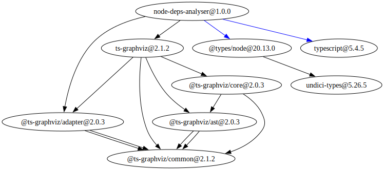

<div align="center">
    <h1>node-deps-analyser (nda)</h1>
</div>

<div align="center">
    
</div>

## Installation

You must installed [Graphviz](https://graphviz.org) firstly.

```bash
git clone github.com/mistgc/node-deps-analyser.git
yarn global add file:$(pwd)/node-deps-analyser
```

## Usage

```plaintext
Usage:
    nda [option] <target path>

Options:
    -D, --depth <number>
    -J, --json
    -F, --format <format>
    -O, --output <output path>

Format:
    svg, png, jpg.

Examples:
    nda --json ./node-deps-analyser
    nda --depth 3 --json ./node-deps-analyser
    nda ./node-deps-analyser
    nda --format png --output /tmp/output.png ./node-deps-analyser
```
